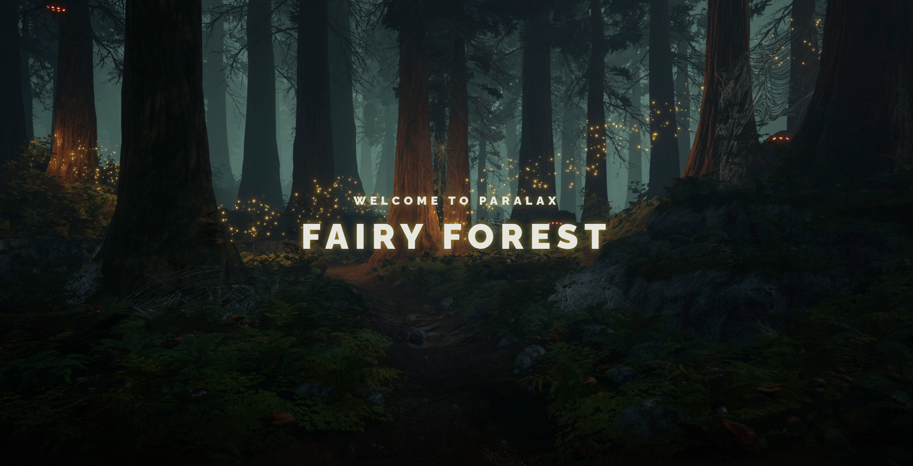
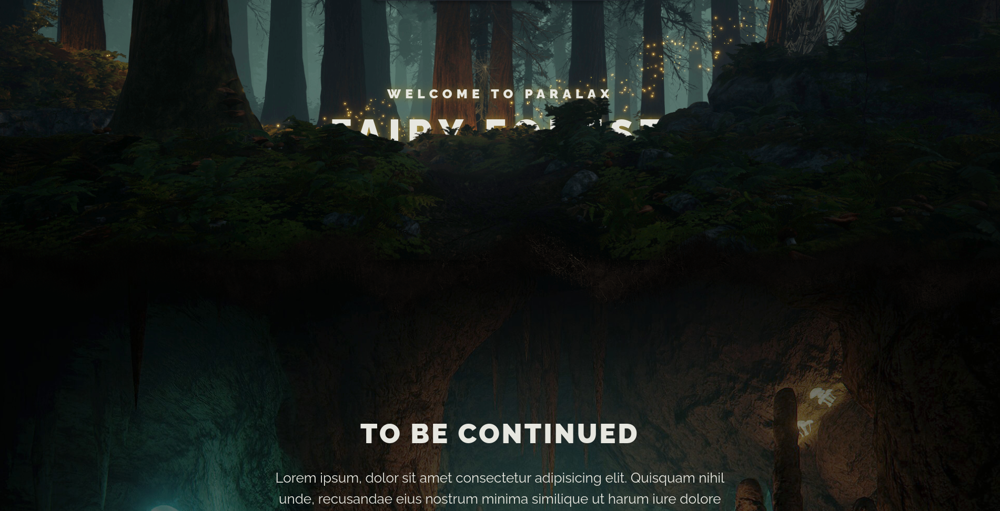
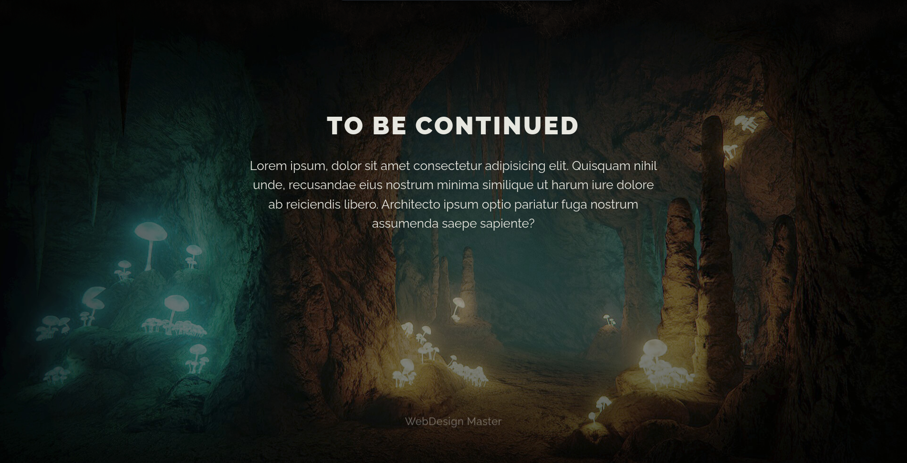

# Parallax Effect Project

This project is a simple demonstration of the parallax effect using HTML, CSS, and JS.

# Description

The parallax effect is a popular technique in web design that creates a 3D-like effect by moving different layers of an image or content at different speeds as the user scrolls. This project uses HTML, CSS, and JS to create a simple parallax effect using two layers of images.

# Installation

To run this project, simply download or clone the repository and open the index.html file in a web browser.

bash
Copy code

## git clone https://github.com/COLECTOR097/Paralax-forest.git

# Usage

To use this project, simply open the index.html file in a web browser. You should see a simple web page with two layers of images. As you scroll down the page, the layers will move at different speeds to create a parallax effect.

# Screenshots

# Contributing

Contributions are welcome! If you would like to contribute to this project, please fork the repository and submit a pull request with your changes.

# License

This project is licensed under the MIT License - see the LICENSE.md file for details.
